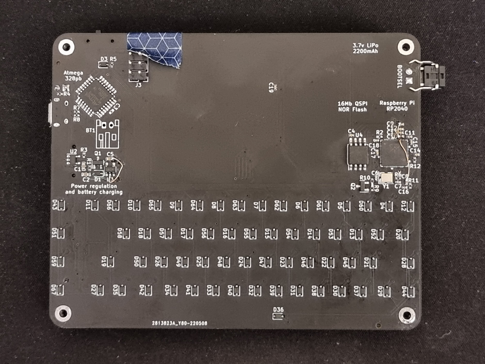
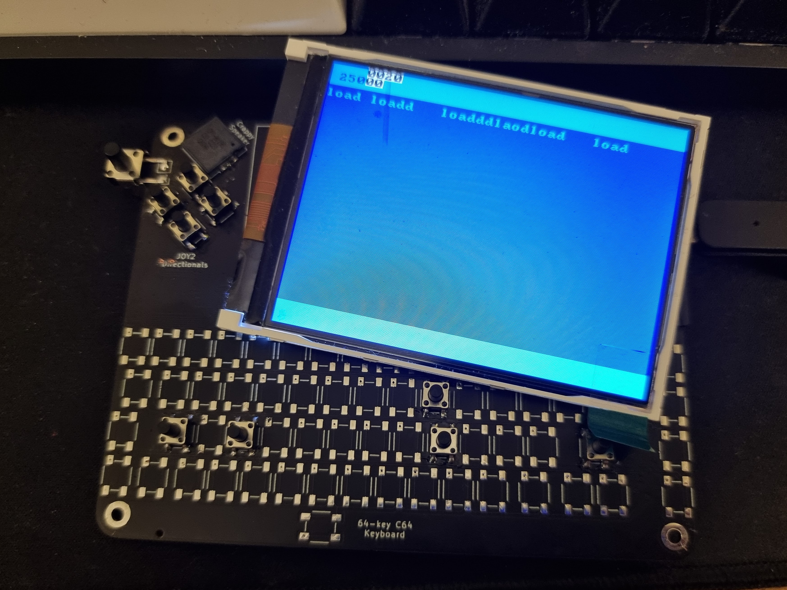
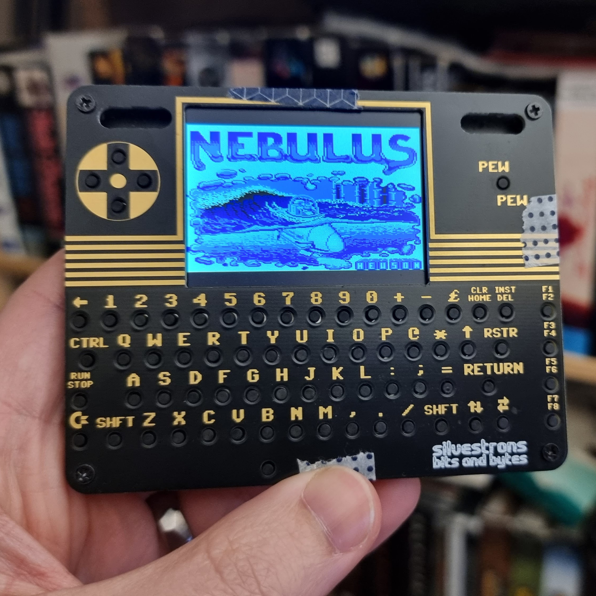
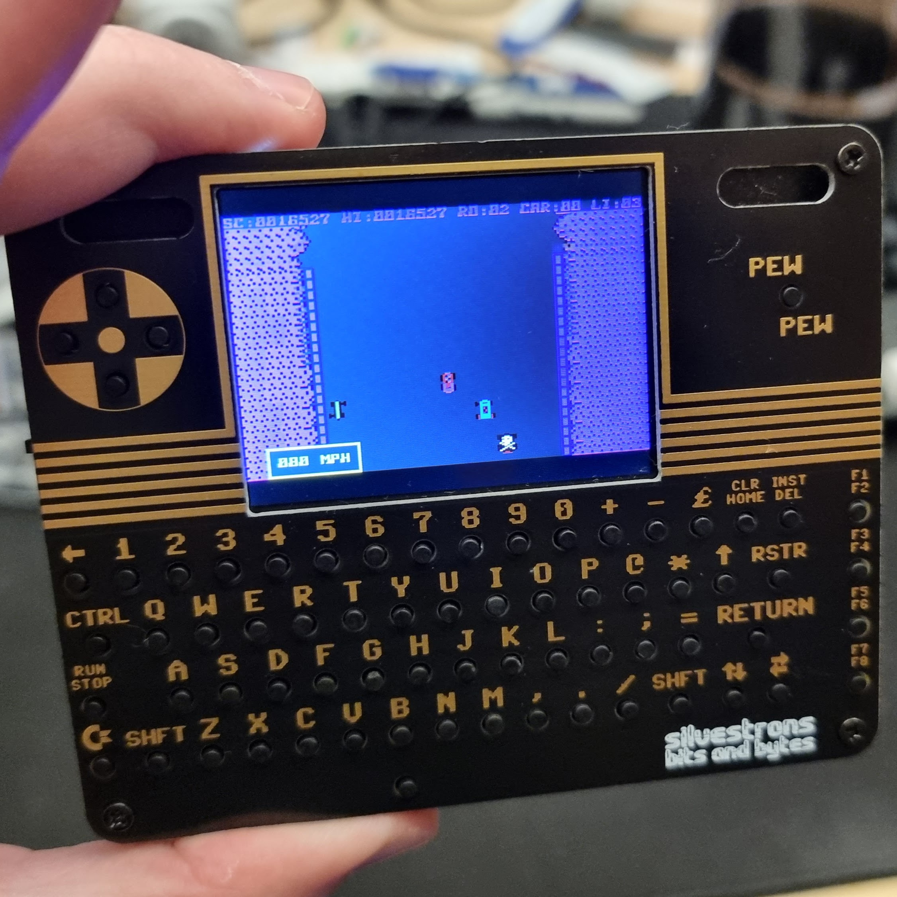
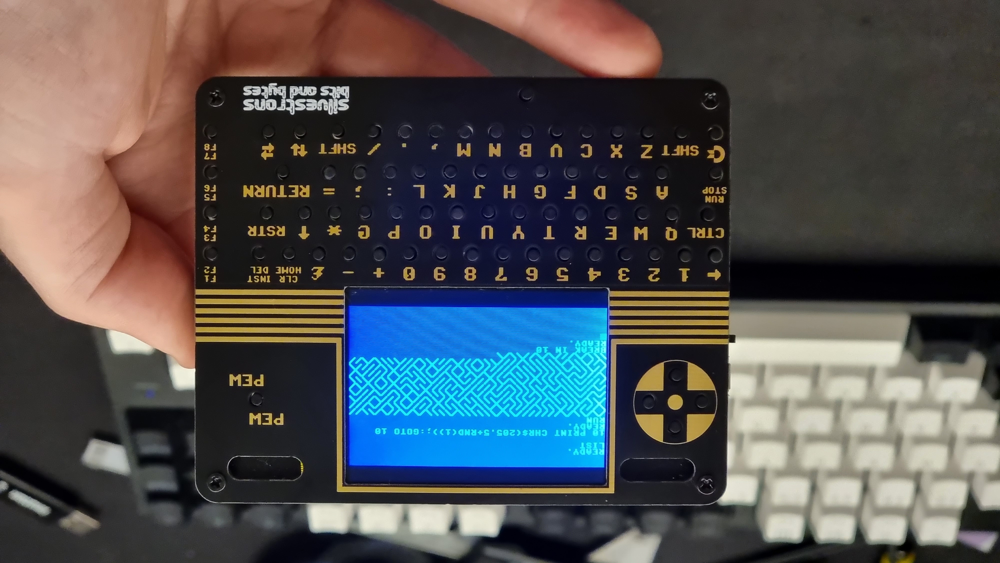

# C64 Pico

This is a tiny emulated C64 running on a Raspberry Pi Pico! Full details of the build can be found at https://www.youtube.com/watch?v=hgLhGpbC6E4

It was designed to dangle around my neck from a lanyard while I was wandering the halls and sections of PAX Aus 2022. It measures 102x81x16mm!

## Building

Wanna build one yourself? I go over the full build steps of this in the video linked above!

### BOM

I've put together an interactive BOM that you can reference - simply checkout the repo and open `ibom.html` in your browser.

Most of the parts can be figured out from the BOM or schematic, or are generic enough to just pick whatever fits (like all the caps and resistors), but some are pretty specific - here's a few purchasing links from the various sellers I used during this build;

* MicroSD card slot - https://www.aliexpress.com/item/32906952129.html
* TFT LCD - https://www.aliexpress.com/item/32837085500.html
* LCD FPC connector - https://www.digikey.com.au/en/products/detail/cvilux-usa/CF4240FH0R0-05-NH/15793119
* Crappy speaker - https://www.digikey.com.au/en/products/detail/cui-devices/CPT-9019S-SMT-TR/6012432
* Power switch - https://www.digikey.com.au/en/products/detail/c-k/JS102011SAQN/1640095
* Tac switches - https://www.digikey.com.au/en/products/detail/c-k/PTS-647-SN70-SMTR2-LFS/9649854
* LiPo battery - https://www.ebay.com.au/itm/143873020947

### PCBs

I designed the board to be fabricated specifically at JLCPCB with their SMT assembly service, so it should be pretty straightforward to get those made up.

Follow JLCPCB's guide on generating their bom and pos files from Kicad, and the components that can be placed by their SMT assembly service already have the correct and matching LCSC part number associated. Only the back layer needs assembly.

### Programming

The software provided for both the keyboard and MCUME modifications are not what I'd call "production-ready" either, and are really just a hack job. I might clean them up to be merged back one day, but probably not.

The keyboard code is in this repo underneath the keyboard directory, and can be programmed directly onto the ATmega328PB via ICSP headers using the Arduino software.

The RPi Pico code can be found in [my fork of the MCUME repo](https://github.com/silvervest/MCUME/tree/c64pico) under branch `c64pico` and you can follow the main instructions for building, installation and use.

### Face and back plates

The faceplate is just a plain PCB, and the PCB design files can be provided to your fab like any other. I recommend getting it HASL gold covered for extra shiny.

The backplate was designed to be laser cut from 1.5mm-2mm acrylic. I had mine created by [The Laser Cut Shop](https://thelasercutshop.com.au/) and the team there were excellent. I used the plotting function in KiCad to export DXF files for them to use.

## Instructions

Once it's complete, pop your SD card with .PRG files available into the slot and switch it on.

Pick whatever program you'd like to open and press the FIRE joystick button "pew pew". By default, the built-in joystick is "plugged" into JOY1 port, and you can switch that between JOY1/JOY2 using F1/F3 keys. Most C64 games use JOY2, so you might need to experiment.

At the BASIC prompt, type `LOAD` and press RETURN. That will load the .PRG file contents into RAM. Once READY, type `RUN` and press RETURN.

Enjoy! It's a bit slow, and some games are buggy as hell. I love playing Nebulus and Choplifter :)

## Development Photos

An early design, showing the overengineered reimplementation of the RP2040 Pico circuit and power management. It worked, but I didn't like it, so threw most of it out. You can also see I added full diodes into the keyboard for the hell of it.

This was when I was writing the Arduino code for the keyboard and I2C protocol, and a test program running on the Pico decoding it and showing the output.

Finally fully working, so I booted up my favourite C64 game - Nebulus! The screen and battery were still held on with washi tape here.

Also Burnin' Rubber because that game is awesome and runs at almost full speed with no bugs that I could find!

And of course, I've gotta run the classic [10print maze](https://10print.org/)

## Acknowledgements

 - [MCUME](https://github.com/Jean-MarcHarvengt/MCUME)

    The base emulator at the guts of this, and was modified for my purposes.

 - [PICOmputer](https://github.com/bobricius/PICOmputer)

    Heavy inspiration taken from this project (and I stole the UDLR joystick layout)

## License

[CERN OHL v2 Strongly Reciprocal](https://choosealicense.com/licenses/cern-ohl-s-2.0/)

